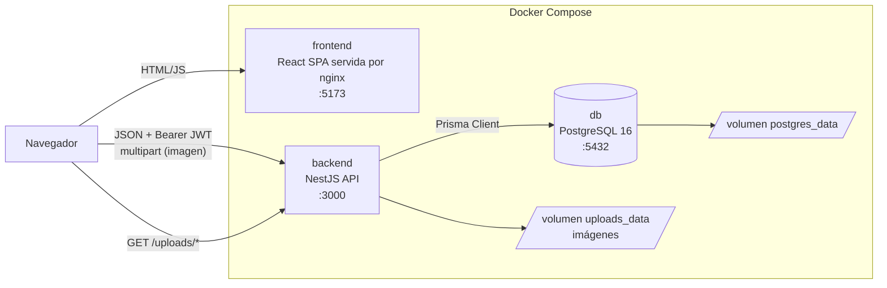
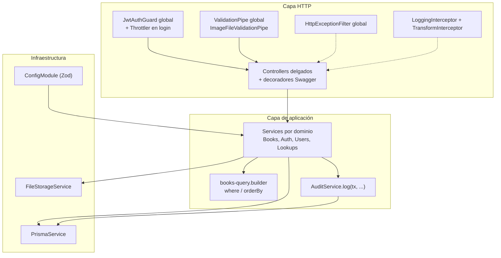
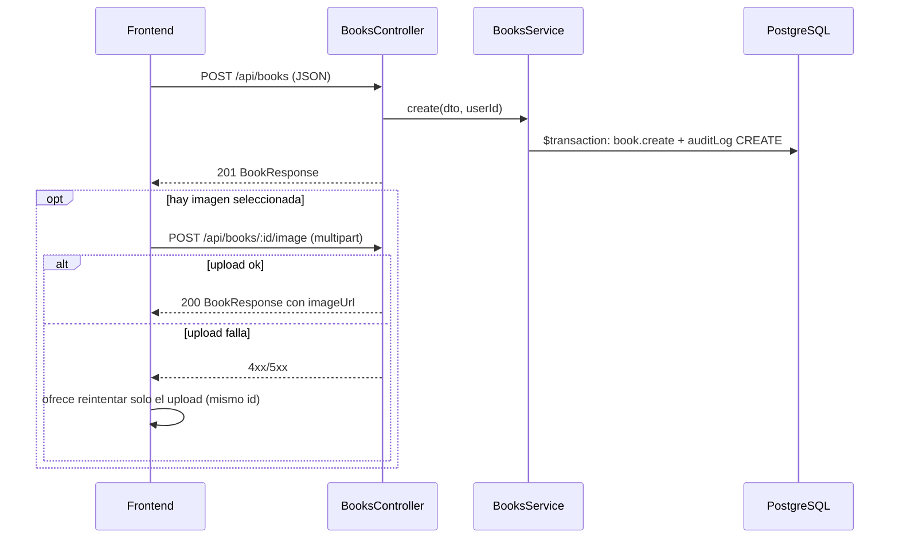
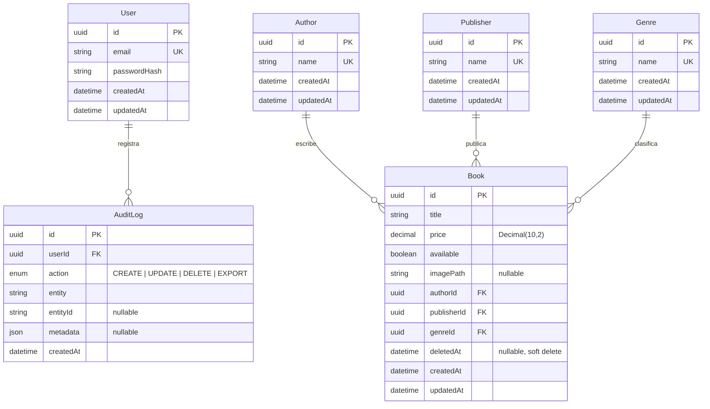

# Arquitectura y modelo de datos

Complemento del [`README.md`](../README.md). Diagramas de capas, flujo de alta con imagen, modelo relacional e índices (REQ-DOC3, REQ-DOC4).

---

## Vista del sistema

La SPA corre en el navegador y llama directamente al API (`VITE_API_BASE_URL`); nginx solo sirve los archivos estáticos del build. El backend es el único que accede a la base de datos y al volumen de imágenes.

---

## Capas del backend

- **Módulos por dominio** (`backend/src/modules/`): `config`, `prisma`, `health`, `auth`, `users`, `authors`, `publishers`, `genres`, `books`, `audit`.
- **Controllers** solo mapean HTTP ↔ DTO; la lógica y las transacciones viven en los services.
- **Transacciones**: create/update/delete de libro, cambio de imagen y export escriben el `AuditLog` en la misma `prisma.$transaction`; si la auditoría falla, la mutación hace rollback.
- **Observabilidad y contrato HTTP** (REQ-B9): `LoggingInterceptor` registra método, ruta, status, latencia y `userId`. `TransformInterceptor` envuelve JSON de éxito en `{ success, data, statusCode, timestamp, path }` (con `meta` aplanado en listados). CSV, 204 y Swagger se omiten. Cómo verlo: [`auditoria-y-observabilidad.md`](./auditoria-y-observabilidad.md).
- **Frontend** (`frontend/src/`): `app/` (router y providers), `features/auth` y `features/books`, `shared/` (cliente HTTP con Bearer, unwrap del envelope y 401, estados de UI, hooks).

---

## Flujo crear libro con imagen

---

## Modelo relacional

Fuente de verdad: [`backend/prisma/schema.prisma`](../backend/prisma/schema.prisma). Migraciones versionadas en `backend/prisma/migrations/`.

`AuditLog` es append-only: las operaciones se consultan en esa tabla, no hay UPDATE/DELETE de auditoría en la app. Cómo inspeccionarla: [`auditoria-y-observabilidad.md`](./auditoria-y-observabilidad.md).

---

## Índices

| Índice | Tabla | Para qué |
|--------|-------|----------|
| `email` único | User | Lookup en login |
| `name` único | Author, Publisher, Genre | Evita duplicados; selects ordenados |
| `deletedAt` | Book | Predicado `deletedAt IS NULL` presente en casi todas las consultas |
| `genreId`, `publisherId`, `authorId`, `available` | Book | Filtros del listado y del CSV |
| `title`, `price` | Book | Ordenamiento dinámico (y prefijos de título) |
| `(deletedAt, genreId, publisherId, authorId)` | Book | Patrón típico: activos + filtros combinados |
| `createdAt`, `(entity, entityId)`, `userId` | AuditLog | Consultas por fecha, por entidad y por usuario |

La justificación detallada está en [`specs/design.md` §4](../specs/design.md#4-índices-justificación).
