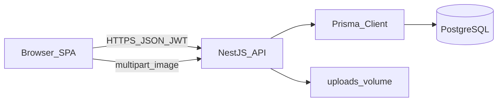
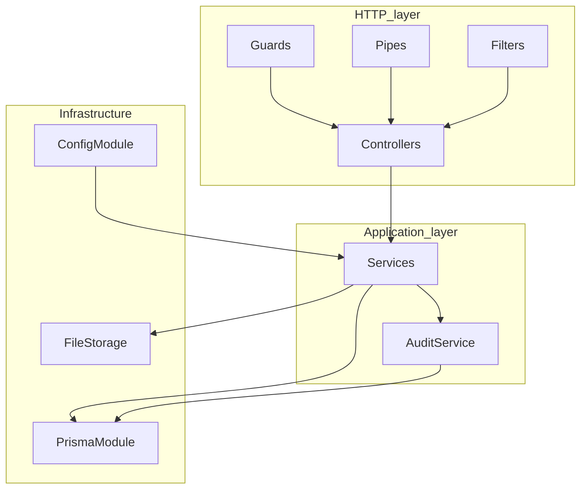
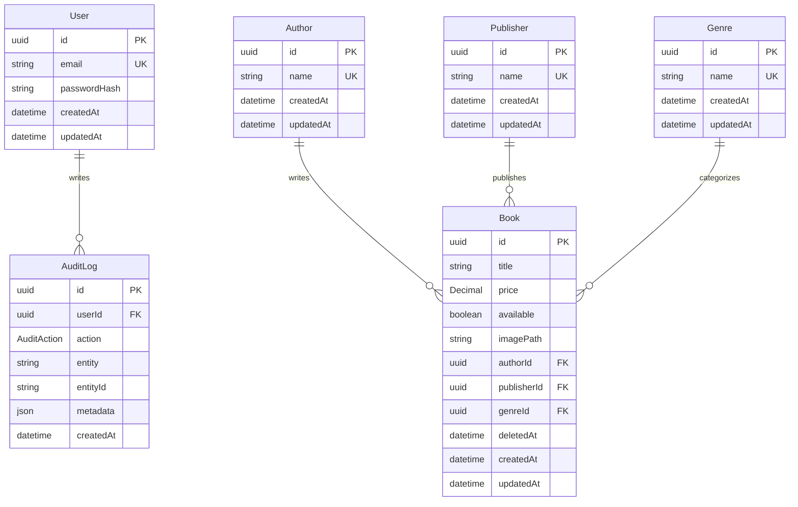
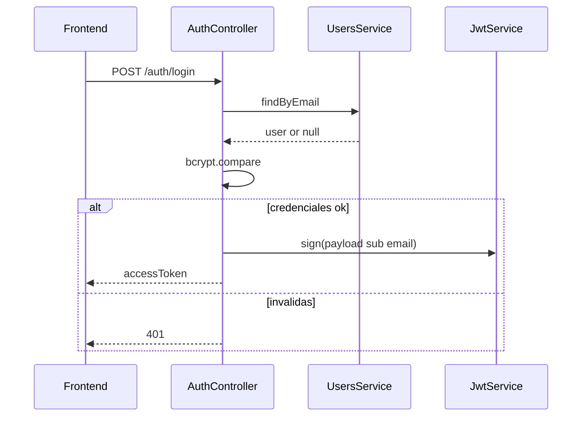
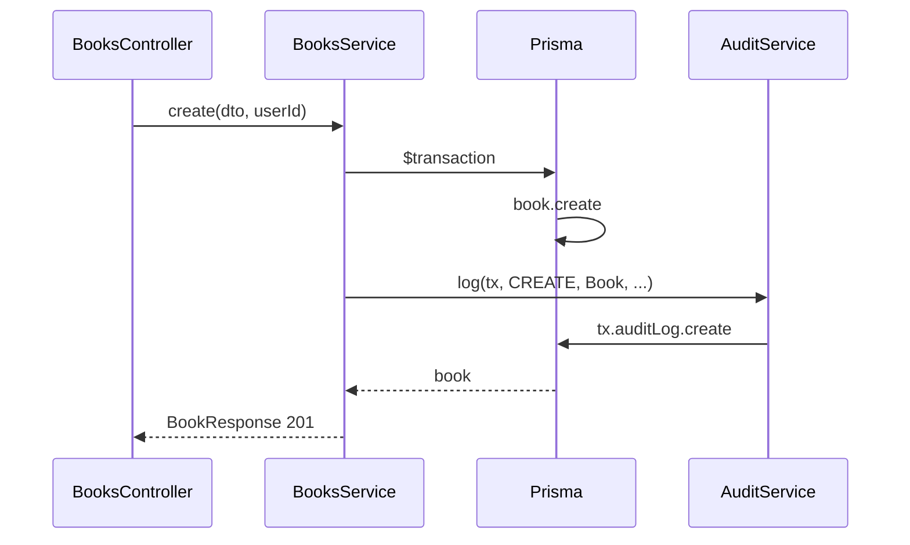

# Design: CMPC-libros

Especificación de diseño derivada de [`requirements.md`](./requirements.md). Objetivo: arquitectura implementable para un ambiente productivo, con supuestos documentados.

## 1. Arquitectura del sistema

### 1.1 Vista general

Monorepo con tres servicios orquestados por Docker Compose:

| Servicio | Tecnología | Rol |
|----------|------------|-----|
| `frontend` | React + TypeScript (Vite), build estático servido por nginx | SPA: login, listado, formularios, detalle |
| `backend` | NestJS + TypeScript + Prisma | API REST, auth JWT, auditoría, CSV, imágenes |
| `db` | PostgreSQL 16 | Persistencia relacional |

Las imágenes de portada se almacenan en un volumen local (`uploads/`) montado en el contenedor del backend (supuesto A4). En producción se migraría a object storage (S3 o equivalente).



### 1.2 Capas del backend



- **Controllers**: delgados; mapean HTTP ↔ DTO y delegan.
- **Services**: reglas de negocio, consultas avanzadas, transacciones Prisma.
- **DTOs + `class-validator`**: validación de entrada (REQ-B1, REQ-B7).
- **Guards**: JWT global; rutas públicas marcadas con `@Public()`.
- **Exception filter global**: formato de error uniforme `{ statusCode, message, error, timestamp, path }`.
- **Config**: variables de entorno validadas al arrancar (Joi o Zod); sin secretos en código (REQ-B8).

### 1.3 Mapa de carpetas (propuesto)

```text
/
├── docker-compose.yml
├── .env.example
├── frontend/
│   ├── Dockerfile
│   ├── nginx.conf           # fallback SPA (ver §8)
│   ├── src/
│   │   ├── features/auth/
│   │   ├── features/books/
│   │   ├── shared/          # UI states, http client, hooks
│   │   └── app/             # router, providers
│   └── ...
├── backend/
│   ├── prisma/
│   │   ├── schema.prisma
│   │   ├── migrations/
│   │   └── seed.ts
│   ├── uploads/             # volumen (gitignored)
│   └── src/
│       ├── main.ts
│       ├── app.module.ts
│       ├── common/          # filters, decorators, interceptors
│       └── modules/
│           ├── config/
│           ├── prisma/
│           ├── auth/
│           ├── users/
│           ├── authors/
│           ├── publishers/
│           ├── genres/
│           ├── books/
│           └── audit/
├── docs/
│   └── pending.md
└── specs/
    ├── requirements.md
    └── design.md
```

### 1.4 Decisiones de diseño

| Decisión | Elección | Justificación |
|----------|----------|---------------|
| Auth | JWT Bearer, vida corta (15–60 min), bcrypt | REQ-B2, A3, A6; refresh token queda en `pending.md` |
| Registro | No hay registro público; usuarios vía seed | A3 |
| Relación libro | 1:N con Author, Publisher, Genre | A1; evolución N:M documentada en pending |
| Disponibilidad | `Boolean available` | A2 |
| Precio | `Decimal(10,2)` | REQ-D2; evita float |
| Soft delete | `deletedAt DateTime?` | REQ-D4, REQ-B5 |
| Imagen | Un `imagePath` nullable + endpoint multipart | REQ-D5, REQ-B3.2, A4 |
| Auditoría | Tabla `AuditLog` append-only en la misma `$transaction` | REQ-B6, REQ-DB4 |
| CSV | Mismos filtros que el listado; excluye soft-deleted | REQ-B4, A5 |
| Lookups | GET authors/publishers/genres; POST authors | Formularios F3 / F3.3 |
| Interceptor de respuestas | `LoggingInterceptor` global de observabilidad; **sin** envelope global | REQ-B9; el listado ya trae su `{ data, meta }` y el CSV de REQ-B4 no es JSON |

---

## 2. Módulos NestJS

Arquitectura modular por dominio (REQ-B1). Cada módulo exporta solo lo necesario; la lógica vive en servicios.

| Módulo | Responsabilidad | Dependencias típicas |
|--------|-----------------|----------------------|
| `ConfigModule` (global) | Carga y valida env al boot (`DATABASE_URL`, `JWT_SECRET`, `JWT_EXPIRES_IN`, `UPLOAD_DIR`, `MAX_IMAGE_BYTES`, `PORT`, `CORS_ORIGIN`) | — |
| `PrismaModule` (global) | `PrismaService` tipado; lifecycle `onModuleInit` / `onModuleDestroy` | Config |
| `AuthModule` | `POST /auth/login`, JwtStrategy, JwtAuthGuard global, `@Public()` | Users, Config |
| `UsersModule` | Lectura de usuario por email/id (sin registro) | Prisma |
| `AuthorsModule` | `GET` de autores para selects y `POST` para alta por nombre (reutiliza si ya existe) | Prisma, Audit |
| `PublishersModule` | Solo `GET` para selects (sin POST/alta) | Prisma |
| `GenresModule` | Solo `GET` para selects (sin POST/alta) | Prisma |
| `BooksModule` | CRUD, filtros, soft delete, imagen, export CSV | Prisma, Audit, FileStorage |
| `AuditModule` | `AuditService.log(tx, ...)` recibe el client de la transacción Prisma | Prisma |

### 2.1 Patrones por módulo

- **Controllers delgados**: sin acceso directo a Prisma.
- **DTOs** por operación: `LoginDto`, `CreateBookDto`, `UpdateBookDto`, `ListBooksQueryDto`, `CreateAuthorDto`.
- **ValidationPipe** global (`whitelist`, `forbidNonWhitelisted`, `transform`).
- **Transacciones** (`prisma.$transaction`) en create/update/delete de libro + auditoría, y en export (solo lectura + log de auditoría).
- **Swagger**: decoradores en controllers; documento OpenAPI en `/api/docs` (REQ-DOC2).
- **Interceptor global** `LoggingInterceptor` (REQ-B9), registrado en `main.ts` junto al `ValidationPipe` y al filtro de excepciones:
  - Envuelve el stream de respuesta con `tap` / `catchError` de RxJS y mide la latencia con `Date.now()` alrededor de `next.handle()`.
  - Emite una línea por request: `METHOD /ruta status +Xms` más el `userId` si `request.user` existe (lo puebla el `JwtAuthGuard`).
  - En error deja registro con el status resuelto por el `HttpExceptionFilter` y **re-lanza** la excepción: el filtro sigue siendo el único que formatea la respuesta.
  - No transforma el payload: el contrato de cada endpoint es el del DTO documentado en Swagger. Un envelope `{ data, meta }` queda descartado (ver §1.4) porque el listado ya devuelve su propio `{ data, meta: { page, limit, total, totalPages } }` — envolverlo otra vez daría `data.data` — y el export CSV responde `text/csv`.

### 2.2 Frontend (alcance de diseño)

Stack de datos y formularios:

- **TanStack React Query**: cache y estado de servidor (listado, detalle, lookups `GET /authors|publishers|genres`, mutación `POST /authors`, mutaciones create/update/delete/export de libros). Invalidación de queries tras mutaciones exitosas.
- **react-hook-form + Zod**: formulario único create/edit; schema Zod compartido (o espejo del DTO); errores por campo en vivo; submit bloqueado si inválido; autor existente o nuevo (REQ-F3, F3.1, F3.3).
- Cliente HTTP con interceptor que adjunta `Authorization: Bearer <token>`.
- 401 → limpia token y redirige a login (REQ-F1).
- Listado: query params espejo del backend; debounce ~300 ms en `search` (solo título) (REQ-F2.4).
- Export CSV (REQ-B4): botón en el listado. Llama `GET /books/export/csv` con los filtros actuales (sin `page`/`limit`) por el cliente HTTP (Bearer). La respuesta se convierte en `Blob` y se descarga con un `<a download>` temporal; un `href` directo no enviaría el token.
- Eliminar (REQ-B5): botón en el detalle con confirmación. Mutación `DELETE /books/:id` que invalida listado y detalle y navega a `/books`.
- Estados loading / empty / error (REQ-F5).
- **`ErrorBoundary`** (class component, `getDerivedStateFromError` + `componentDidCatch`) envolviendo el router dentro de `App` (REQ-F6). Cubre el hueco que React Query no cubre: errores de red ya se manejan por query/mutation, pero un throw durante el render deja pantalla en blanco. El fallback muestra un mensaje y un botón que resetea el estado del boundary para reintentar el render.

#### Flujo crear libro → subir imagen (con reintento)

1. Usuario completa el formulario (datos + archivo opcional en el cliente; preview local).
2. `POST /books` (JSON) → si falla, se muestra error y no se intenta upload.
3. Si hay imagen pendiente: `POST /books/:id/image` con el archivo.
4. Si el upload falla (red/4xx/5xx): el libro **ya existe**; la UI ofrece **reintentar solo el upload** (sin recrear el libro), manteniendo el `id` y el archivo en memoria/estado local.
5. Tras éxito (o si no había imagen): invalidar queries de listado/detalle y navegar al detalle o listado.
6. En edición: `PATCH /books/:id` y, si cambió la imagen, el mismo upload con reintento independiente.

---

## 3. Schema Prisma

### 3.1 Modelo relacional



### 3.2 `schema.prisma` (especificación)

```prisma
generator client {
  provider = "prisma-client-js"
}

datasource db {
  provider = "postgresql"
  url      = env("DATABASE_URL")
}

enum AuditAction {
  CREATE
  UPDATE
  DELETE
  EXPORT
}

model User {
  id           String     @id @default(uuid()) @db.Uuid
  email        String     @unique
  passwordHash String
  createdAt    DateTime   @default(now())
  updatedAt    DateTime   @updatedAt
  auditLogs    AuditLog[]
}

model Author {
  id        String   @id @default(uuid()) @db.Uuid
  name      String   @unique
  createdAt DateTime @default(now())
  updatedAt DateTime @updatedAt
  books     Book[]
}

model Publisher {
  id        String   @id @default(uuid()) @db.Uuid
  name      String   @unique
  createdAt DateTime @default(now())
  updatedAt DateTime @updatedAt
  books     Book[]
}

model Genre {
  id        String   @id @default(uuid()) @db.Uuid
  name      String   @unique
  createdAt DateTime @default(now())
  updatedAt DateTime @updatedAt
  books     Book[]
}

model Book {
  id          String     @id @default(uuid()) @db.Uuid
  title       String
  price       Decimal    @db.Decimal(10, 2)
  available   Boolean    @default(true)
  imagePath   String?
  authorId    String     @db.Uuid
  publisherId String     @db.Uuid
  genreId     String     @db.Uuid
  deletedAt   DateTime?
  createdAt   DateTime   @default(now())
  updatedAt   DateTime   @updatedAt

  author      Author     @relation(fields: [authorId], references: [id])
  publisher   Publisher  @relation(fields: [publisherId], references: [id])
  genre       Genre      @relation(fields: [genreId], references: [id])

  @@index([deletedAt])
  @@index([genreId])
  @@index([publisherId])
  @@index([authorId])
  @@index([available])
  @@index([title])
  @@index([price])
  @@index([deletedAt, genreId, publisherId, authorId])
}

model AuditLog {
  id        String      @id @default(uuid()) @db.Uuid
  userId    String      @db.Uuid
  action    AuditAction
  entity    String
  entityId  String?
  metadata  Json?
  createdAt DateTime    @default(now())

  user      User        @relation(fields: [userId], references: [id])

  @@index([createdAt])
  @@index([entity, entityId])
  @@index([userId])
}
```

### 3.3 Reglas de dominio en persistencia

- Consultas de listado/detalle/CSV: siempre `deletedAt: null` salvo endpoints admin futuros.
- Soft delete: `UPDATE` de `deletedAt = now()`; no `DELETE` físico.
- Precio: serializar a string en JSON de respuesta para no perder precisión (`"19.99"`).
- `imagePath`: ruta relativa bajo `UPLOAD_DIR` con nombre `<bookId>-<timestamp>.<ext>` (ej. `books/<uuid>-1710000000000.webp`); al reemplazar se borra el archivo anterior. URL vía static serve de `/uploads` (ver §7).
- Seed (REQ-DB5): 1 usuario de prueba + autores/editoriales/géneros + N libros de ejemplo.

---

## 4. Índices (justificación)

REQ-DB3 exige índices sobre columnas de filtro, orden y búsqueda frecuentes.

| Índice | Modelo | Uso | Justificación |
|--------|--------|-----|---------------|
| `@unique` en `email` | User | Login | Lookup O(1) por email en auth |
| `@unique` en `name` | Author, Publisher, Genre | Lookups / integridad | Evita duplicados y acelera select |
| `@@index([deletedAt])` | Book | Casi todas las queries | Predicado fijo `IS NULL` en listados |
| `@@index([genreId])` | Book | Filtro F2.1 | Equality join/filter |
| `@@index([publisherId])` | Book | Filtro F2.1 | Idem |
| `@@index([authorId])` | Book | Filtro F2.1 / sort por autor | Idem + join |
| `@@index([available])` | Book | Filtro disponibilidad | Baja cardinalidad pero barato y útil con otros filtros |
| `@@index([title])` | Book | `ORDER BY title`, prefijo de búsqueda | Sort y `startsWith` / `contains` con coste aceptable en catálogo pequeño-mediano |
| `@@index([price])` | Book | `ORDER BY price` | Ordenamiento dinámico F2.2 |
| `@@index([deletedAt, genreId, publisherId, authorId])` | Book | Listado filtrado típico | Índice compuesto que cubre el patrón más común: activos + filtros combinables |
| `@@index([createdAt])` | AuditLog | Consultas temporales | Auditoría por rango de fechas |
| `@@index([entity, entityId])` | AuditLog | Historial de un libro | Trazabilidad por entidad |
| `@@index([userId])` | AuditLog | Acciones por usuario | Quién hizo qué |

**Búsqueda de texto (`search`)**: solo sobre `title` (`contains`, case-insensitive vía `mode: 'insensitive'` de Prisma). No busca por autor ni otros campos. El índice B-tree en `title` ayuda a ordenar y a prefijos; para `ILIKE '%term%'` a escala mayor se documenta evolución a `pg_trgm` + GIN en `docs/pending.md`.

---

## 5. Endpoints REST

Base URL: `/api` (prefijo global). Autenticación: `Authorization: Bearer <accessToken>` en todas las rutas salvo las marcadas públicas. Swagger en `/api/docs`.

### 5.1 Auth

| Método | Ruta | Auth | Descripción | Status |
|--------|------|------|-------------|--------|
| `POST` | `/auth/login` | Público | Body: `{ email, password }` → `{ accessToken, expiresIn }` | 200 / 401 |

### 5.2 Books

| Método | Ruta | Auth | Descripción | Status |
|--------|------|------|-------------|--------|
| `GET` | `/books` | JWT | Listado paginado + filtros | 200 |
| `GET` | `/books/export/csv` | JWT | Export CSV (mismos filtros; sin soft-deleted) | 200 (`text/csv`) |
| `GET` | `/books/:id` | JWT | Detalle con autor, editorial, género | 200 / 404 |
| `POST` | `/books` | JWT | Alta (JSON). Imagen en endpoint aparte | 201 |
| `PATCH` | `/books/:id` | JWT | Edición parcial | 200 / 404 |
| `DELETE` | `/books/:id` | JWT | Soft delete | 204 / 404 |
| `POST` | `/books/:id/image` | JWT | Multipart `file`; magic bytes + tamaño; nombre `<bookId>-<timestamp>.<ext>`; borra la anterior | 200 / 400 / 404 |

**Nota de routing**: declarar `/books/export/csv` antes de `/books/:id` (o usar path fijo) para no capturar `export` como UUID.

#### Query params de `GET /books` y `GET /books/export/csv`

| Param | Tipo | Default | Descripción |
|-------|------|---------|-------------|
| `page` | int ≥ 1 | `1` | Página (solo listado) |
| `limit` | int 1–100 | `20` | Tamaño de página (solo listado) |
| `search` | string | — | Búsqueda solo por título |
| `genreId` | uuid | — | Filtro exacto |
| `publisherId` | uuid | — | Filtro exacto |
| `authorId` | uuid | — | Filtro exacto |
| `available` | boolean | — | Filtro exacto |
| `sortBy` | enum | `title` | `title` \| `price` \| `createdAt` \| `author` |
| `sortOrder` | enum | `asc` | `asc` \| `desc` |

Respuesta listado:

```json
{
  "data": [ /* BookResponse[] */ ],
  "meta": { "page": 1, "limit": 20, "total": 42, "totalPages": 3 }
}
```

#### Body `POST /books` / `PATCH /books/:id`

```json
{
  "title": "string",
  "price": "19.99",
  "available": true,
  "authorId": "uuid",
  "publisherId": "uuid",
  "genreId": "uuid"
}
```

`BookResponse` incluye relaciones embebidas (`author`, `publisher`, `genre`) y `imageUrl` derivado de `imagePath`.

#### Upload de imagen

- Campo multipart: `file`
- Validación por **magic bytes** (no confiar solo en `Content-Type` del cliente): JPEG, PNG, WebP
- Tamaño máximo: configurable (`MAX_IMAGE_BYTES`, ej. 2 MiB)
- Nombre en disco: `<bookId>-<timestamp>.<ext>` bajo `UPLOAD_DIR/books/`
- Al guardar: escribe el nuevo archivo, actualiza `imagePath`, **borra el archivo anterior** si existía, registra auditoría `UPDATE` en transacción (con `tx`)

### 5.3 Lookups (formularios)

Editoriales y géneros son de solo lectura (seed). Autores admiten alta desde el formulario de libro (REQ-F3.3): si el nombre ya existe (case-insensitive) se reutiliza.

| Método | Ruta | Auth | Descripción | Status |
|--------|------|------|-------------|--------|
| `GET` | `/authors` | JWT | Lista `{ id, name }[]` ordenada por name | 200 |
| `POST` | `/authors` | JWT | Body `{ name }` (1–200, trim). Crea o reutiliza | 201 / 400 / 401 |
| `GET` | `/publishers` | JWT | Idem GET authors | 200 |
| `GET` | `/genres` | JWT | Idem GET authors | 200 |

### 5.4 Health

| Método | Ruta | Auth | Descripción | Status |
|--------|------|------|-------------|--------|
| `GET` | `/health` | Público | Liveness/readiness (`{ status: "ok" }`; opcional ping a DB) | 200 / 503 |

### 5.5 Errores HTTP

| Código | Cuándo |
|--------|--------|
| 400 | Validación DTO / imagen inválida (magic bytes o tamaño) |
| 401 | Token ausente, inválido o expirado |
| 404 | Recurso no encontrado o soft-deleted |
| 429 | Rate limit en login (throttler) |
| 500 | Error no controlado (mensaje genérico al cliente; detalle en logs) |

Formato consistente (REQ-B7):

```json
{
  "statusCode": 400,
  "message": ["title must be a string"],
  "error": "Bad Request",
  "timestamp": "2026-09-29T22:00:00.000Z",
  "path": "/api/books"
}
```

---

## 6. Flujos clave

### 6.1 Login JWT



### 6.2 Crear libro + auditoría (transacción)



`AuditService.log(tx, { userId, action, entity, entityId, metadata? })` **recibe el client transaccional** (`tx`) para que el `AuditLog` se confirme o haga rollback junto con la mutación.

Operaciones críticas en la misma `$transaction`: create/update/soft-delete de libro + `AuditLog`; update de `imagePath` + auditoría.

### 6.3 Soft delete

1. `DELETE /books/:id` → verifica existencia con `deletedAt: null`.
2. `UPDATE { deletedAt: now() }` + `AuditLog DELETE` vía `log(tx, ...)`.
3. Listados, detalle, CSV y upload ignoran filas con `deletedAt != null` (responden 404).

### 6.4 Upload de imagen

1. Validar tamaño y **magic bytes** (JPEG/PNG/WebP) en pipe; rechazar si no coinciden.
2. Persistir archivo en `UPLOAD_DIR/books/<bookId>-<timestamp>.<ext>`.
3. En transacción: actualizar `imagePath`, auditar `UPDATE` con `log(tx, ...)`.
4. Tras commit exitoso: **borrar el archivo anterior** del disco (si existía).
5. Responder `BookResponse` con `imageUrl`.

Flujo front create → upload con reintento: ver §2.2.

### 6.5 Export CSV

1. Reutilizar builder de `where`/`orderBy` del listado (sin paginación, o con límite de seguridad configurable).
2. Excluir soft-deleted.
3. Escapar campos (comillas, separadores, saltos de línea).
4. Columnas: título, autor, editorial, género, precio, disponibilidad.
5. Registrar `AuditLog EXPORT` con `log(tx, ...)` y metadata de filtros aplicados.
6. Headers: `Content-Type: text/csv; charset=utf-8`, `Content-Disposition: attachment; filename="books.csv"`.

---

## 7. Seguridad y healthcheck

- **Helmet**: headers HTTP de seguridad en Nest (`helmet` middleware) en producción y local.
- **Throttler en login**: `@nestjs/throttler` (o equivalente) aplicado a `POST /auth/login` para mitigar fuerza bruta; respuesta `429` al exceder el límite. Resto de rutas sin throttle agresivo en v1.
- **Política de `/uploads`**:
  - Servir solo archivos bajo `UPLOAD_DIR` (path traversal denegado).
  - Métodos de solo lectura (`GET`); sin listado de directorio.
  - `Content-Type` fijo según extensión/magic conocido; `Content-Disposition: inline` para imágenes.
  - No ejecutar scripts: sin CGI; idealmente `X-Content-Type-Options: nosniff` (Helmet).
  - Acceso: en v1 las URLs de imagen pueden ser públicas de solo lectura (el CRUD sigue protegido por JWT); en producción endurecer con URLs firmadas o proxy autenticado (documentar en `pending.md` si no se implementa).
- **Healthcheck**: `GET /health` (público) para Docker/`HEALTHCHECK` y orquestadores; falla (`503`) si la DB no responde cuando se incluye readiness.

---

## 8. Configuración y DevOps (diseño)

Variables mínimas (`.env.example`):

| Variable | Ejemplo | Uso |
|----------|---------|-----|
| `DATABASE_URL` | `postgresql://...` | Prisma |
| `JWT_SECRET` | random ≥ 32 chars | Firma JWT |
| `JWT_EXPIRES_IN` | `30m` | TTL token |
| `PORT` | `3000` | HTTP backend |
| `CORS_ORIGIN` | `http://localhost:5173` | CORS |
| `UPLOAD_DIR` | `/app/uploads` | Disco de imágenes |
| `MAX_IMAGE_BYTES` | `2097152` | Límite upload |

`docker-compose.yml`: servicios `db`, `backend`, `frontend`; al iniciar backend: `prisma migrate deploy` + `prisma db seed` (REQ-O1, O2). Healthcheck del servicio `backend` apunta a `GET /health`.

### 8.1 Servido estático del frontend (REQ-O4)

El frontend se construye con Vite y el `dist/` resultante se sirve con nginx (`frontend/nginx.conf`, copiado a `/etc/nginx/conf.d/default.conf` en la imagen). Como el enrutado es del cliente (`BrowserRouter`), la configuración por defecto de nginx no sirve: intentaría resolver `/login` como un archivo en disco y devolvería 404 al entrar directo o recargar.

Reglas mínimas:

- `location /` con `try_files $uri $uri/ /index.html`: cualquier ruta sin archivo correspondiente entrega el `index.html` y el router decide qué renderizar.
- `location /assets/` con `try_files $uri =404` y cache larga (`immutable`): los bundles llevan hash, así que un asset inexistente debe fallar como 404 en vez de recibir el HTML con `Content-Type` de JavaScript, error difícil de diagnosticar.

Si en el futuro se usa `HashRouter` o un host con fallback propio (S3 + CloudFront, Netlify, etc.), esta config se reemplaza por el mecanismo equivalente de la plataforma, pero el criterio de REQ-O4 sigue aplicando.

---

## 9. Testing (alineación)

| Capa | Enfoque | Meta |
|------|---------|------|
| Backend | Jest: servicios (Books, Auth) y controllers con mocks de Prisma | ≥ 80 % cobertura (REQ-T3) |
| Frontend | Vitest + Testing Library: hooks/listado/form/login | ≥ 80 % cobertura |

Priorizar tests del builder de filtros, soft delete, hash/login y validación de imagen (magic bytes).

---

## 10. Trazabilidad requisitos → diseño

| Requisito | Sección de diseño |
|-----------|-------------------|
| REQ-D1–D5 | §3 Schema, §1.4 |
| REQ-F1–F5 | §1.3 frontend, §2.2, §5 |
| REQ-B1 | §2 Módulos |
| REQ-B2 | §5.1, §6.1, §7 |
| REQ-B3 / B3.1 / B3.2 | §5.2, §6.4 |
| REQ-B4 | §5.2, §6.5 |
| REQ-B5 | §3.3, §6.3 |
| REQ-B6 | §2 AuditModule, §6.2 |
| REQ-B7 | §5.5 |
| REQ-B8 | §8 |
| REQ-DB1–DB5 | §3, §4, seed en §3.3 |
| REQ-T1–T3 | §9 |
| REQ-O1–O3 | §8 |
| REQ-O4 | §8.1, §1.3 frontend |
| REQ-DOC2–DOC4 | Swagger §2.1; diagramas §1 y §3.1 |
| A1–A6 | §1.4 |

---

## 11. Fuera de alcance / evoluciones

Documentar implementación futura en `docs/pending.md`:

- Refresh token (A6)
- Relación N:M libro–autor (A1)
- Stock numérico (A2)
- Object storage para imágenes (A4)
- Dashboard / métricas (A5)
- `pg_trgm` para búsqueda full-text
- CI/CD y caché (P2)
- Roles y permisos avanzados (fuera de alcance §10 requirements)
- URLs firmadas / proxy autenticado para `/uploads`
